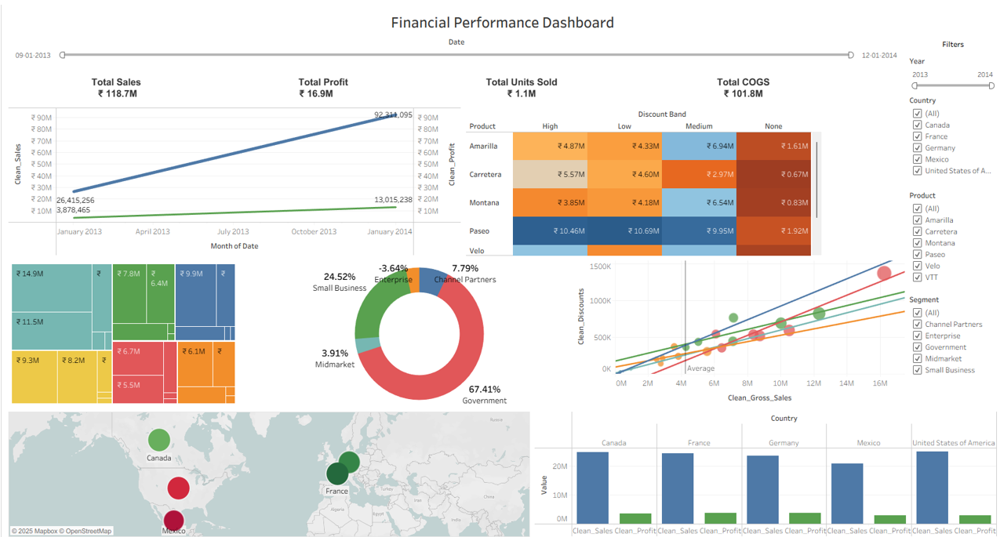

# Financial-Performance-Dashboard
Interactive Tableau dashboard for financial performance analysis using business intelligence techniques and data visualization.

---

## Project Overview

This dashboard analyzes:

- Revenue performance
- Profit analysis
- Country trends
- Product performance
- Monthly financial metrics

---

## Tools Used

- Tableau
- CSV Dataset
- Data Visualization

---

## Project Structure

Financial-Performance-Dashboard/
│── Financial Performance Dashboard.twb
│── financial_data.csv
│── README.md
│── LICENSE
│── .gitignore
│── CONTRIBUTING.md
│── requirements.txt

---

## Dashboard Preview

---

## Setup Steps

1. Download project

2. Open Tableau workbook:

Financial Performance Dashboard.twb

3. Reconnect:

financial_data.csv

4. Run dashboard

---

## Author

Konki Mohit
